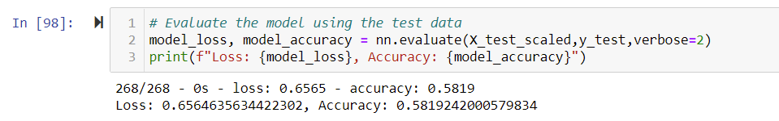

# Loan Predictor Analysis

## Overview
Alphabet Soup is a non-profit organization dedicated to helping organizations protect the environment, improve people's well-being and unify the world. They raise and donate vast sums of money to various companies and would like to utilize machine learning to vet recipients to make sure the organization's money is allocated effectively. They would like to predict which applicants are too high risk to donate to with the use of a deep neural network. 
To do this, I will use the TensorFlow library to create a binary classifier capable of predicting whether an applicant will be successful if funded by Alphabet Soup.

## Results

### Data Preprocessing
 - For this model, the target used was the 'IS_SUCCESSFUL' column. This was a binary measure of whether a company used the money granted to them effectively.
 - The features originally used in this model were the application type, affiliated sector of industry, government organization classification, the use case for funding, organization type, active status, income classification, special consideration for application, and requested funding amount. 
 - The EIN and organization name were removed from the dataset prior to analysis as their sole purpose was identifying the organization. In later optimization attempts, the application status and special considerations were also removed from the features list.
 
 ### Compiling, Training, and Evaluating the Model
 
- How many neurons, layers, and activation functions did you select for your neural network model, and why?
	 - My original model consisted of 2 hidden layers in addition to the input and output layer. The number of neurons in the input layer is equal to the number of features used in the model. The length of the first hidden layer was 80 to reflect twice the size of the original input layer. The second layer was 30, as this was between 1/2 and 1/3 the length of the first hidden layer. The output layer consisted of one neuron to output a binary classification of an organization's status. 
	 - During the optimization process, I tried to increase my first hidden layer to 100 (roughly 3x the input layer) and my second layer to half (50). I also added a third layer with half of that (15) as I hoped this increase in neurons would result in greater accuracy. Amusingly, it did not. 
-   Were you able to achieve the target model performance?
	-   I was not. The closest I got to the target model performance of a 75% accuracy was 70.5% after my first attempt.
-   What steps did you take to try and increase model performance?
	-  The original model resulted in an accuracy of 53.3% (show below) 
	-   The first step I took to increase performance was binning the income variable to reduce the outliers present as an initial look at the counts revealed a number of extreme outliers that skewed the distribution right (shown below). 
	    . This brought the model's accuracy up to the highest it would achieve at 70.5%. 
	     
	-   The second step I took was adding the third hidden nodes layer and increased the size of existing neurons as mentioned above.  This brought the accuracy back down to 50.22% and was a good lesson on why we don't just increase complexity blindly when optimizing a function.          
	-   The third step I took was trying to bin the ask amount factor to reduce outliers and remove the previously added nodes. This brought my accuracy up to 57%, but this was still worse than binning income alone, so it was removed during the fourth attempt.                                                                              
	-   The fourth and final step I took was to remove noisy factors (application status and special considerations), but this only improved accuracy by a negligible degree up to 58%.  After four attempts, it seemed as though my efforts were only reducing my accuracy so I returned to the first step and settled on 70.5% accuracy for now.
	
## Summary
In conclusion, this model was somewhat effective in predicting if an organization used the donated money effectively or not. However, accuracy capped at 75%.  

This deep learning model required several adjustments for optimization and could benefit from greater attention. The model also took several minutes to train each time. A random forest classifier is structurally very similar to a deep learning model; however, it can be trained in a matter of seconds on the same dataset and would be a more efficient model for retraining during the optimization process with similar accuracy. As such, I would recommend it be applied to this problem.